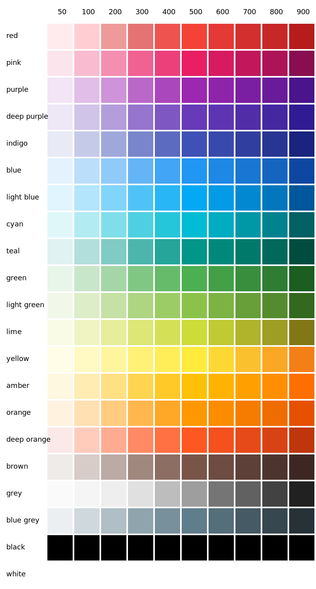

# Palette Material Design
[](https://travis-ci.com/villoro/v-palette)
[](https://codecov.io/gh/villoro/v-palette)

Utility to easily use material design colors.

## Colors

Available colors are:



You can view them in a [svg file](assets/material_grid.svg).

More info at [material.io](https://material.io/design/color/the-color-system.html#color-usage-palettes)

## Installation

You can install it with pip by running:

    pip install v-palette


## Usage

You can retrive one color or a list of colors using `get_colors` function:

```python
from v_palette import get_colors

# Retrive one color
color = get_colors(("red", 100))
# color will be: '#FFCDD2'

# Retrive some colors
colors = get_colors([("red", 100), ("blue", 100)])
# colors will be: ['#FFCDD2', '#BBDEFB']
```


## Authors
* [Arnau Villoro](https://villoro.com)

## License
The content of this repository is licensed under a [MIT](https://opensource.org/licenses/MIT).

## Nomenclature
Branches and commits use some prefixes to keep everything better organized.

### Branches
* **f/:** features
* **r/:** releases
* **h/:** hotfixs

### Commits
* **[NEW]** new features
* **[FIX]** fixes
* **[REF]** refactors
* **[PYL]** [pylint](https://www.pylint.org/) improvements
* **[TST]** tests
